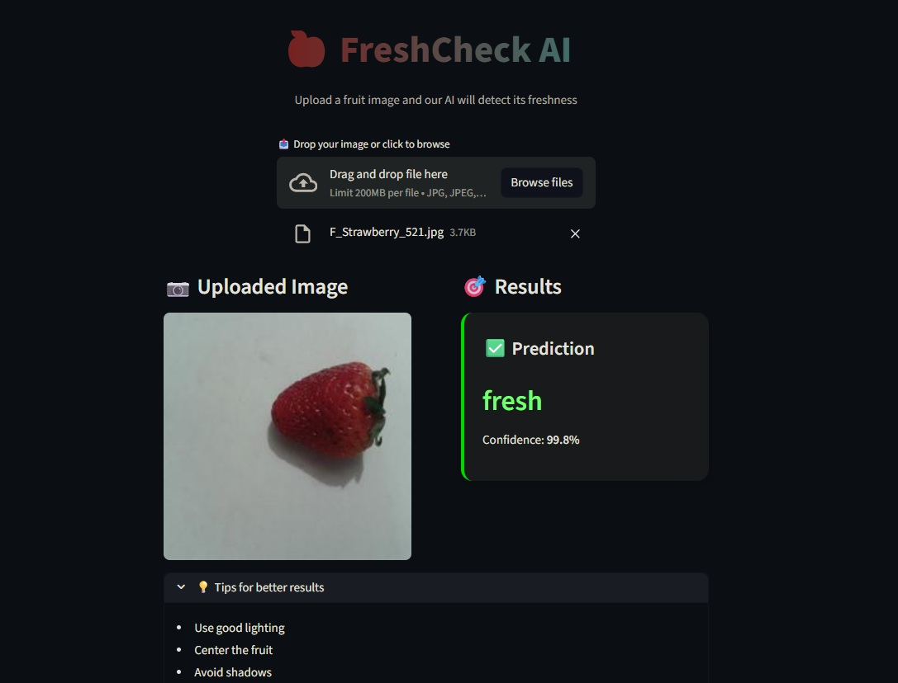

<p align="center">
  
</p>

<h2 align="center">FreshCheck AI – Fresh vs Spoiled Fruit Classifier</h2>
<p align="center"><b>A deep learning–powered application to classify fruits as fresh or spoiled.</b></p>

<p align="center">
  <a href="https://streamlit.io/"></a>
  <a href="https://pytorch.org/"></a>
  <a href="https://pytorch.org/vision/stable/index.html"></a>
  <a href="https://scikit-learn.org/"></a>
  <a href="https://optuna.org/"></a>
</p>

<p align="center">
  <b>Model:</b> ResNet-50 (Transfer Learning) &nbsp; | &nbsp;
  <b>Framework:</b> PyTorch &nbsp; | &nbsp;
  <b>UI:</b> Streamlit
</p>

<p align="center">
  This project demonstrates an end-to-end computer vision workflow — from data preparation and leakage-safe splitting to model training, evaluation, and deployment using Streamlit.
</p>

---

A practical deep learning project that classifies fruit images as <b>fresh</b> or <b>spoiled</b> using a pretrained <b>ResNet-50</b> model.  
The project emphasizes <b>data integrity, correct evaluation, and production-ready deployment</b>, rather than just high accuracy.

---

## 📸 Screenshots


### 🖥️ Streamlit Application Interface


### ✅ Fresh vs Spoiled Result



---

## ✨ Features

- **Binary Classification**: Predicts whether a fruit is fresh or spoiled
- **Multi-Fruit Support**: Trained on 8 different fruits
- **Transfer Learning**: Uses pretrained ResNet-50 for efficient learning
- **Leakage-Safe Dataset Splitting**: Fruit-aware and class-aware splits
- **Minimal Hyperparameter Tuning**: Lightweight Optuna demonstration
- **Fast Inference**: Backbone frozen for quick predictions
- **Interactive UI**: User-friendly Streamlit web app

---

## 📂 Project Structure

```
Fruits_Freshness_Classifier/
│
├── README.md          
├── .gitignore
└──streamlit_app/
    │
    ├── artifacts/
    ├── harvest_classifier_notebook.ipynb
    └── harvest_classifier_resnet50.ipynb
    │
    ├── models/
       └── fruits_classifier_resnet50_tl.pth
    ├── app.py
    ├── app_v2.py # ✅ Main Streamlit application (use this)
    ├── model_definition.py # Model architecture definition
    ├── model_helper.py # Model loading & inference utilities
    ├── requirements.txt

```

---

## 🧠 Model Details

- **Architecture**: ResNet-50 (pretrained on ImageNet)
- **Training Strategy**:
  - Transfer learning
  - Backbone frozen
  - Fully connected layer fine-tuned
- **Classes**:
  - `0 → Fresh`
  - `1 → Spoiled`
- **Input Size**: `224 × 224 RGB`
- **Loss Function**: CrossEntropyLoss
- **Optimizer**: Adam / AdamW (with weight decay)

---

## 🖥️ Setup Instructions

### Prerequisites

- Python 3.9+
- Git

---

### 1️⃣ Clone the Repository

```bash
git clone https://github.com/inv-fourier-transform/Fruits_Freshness_Classifier.git
cd Fruits_Freshness_Classifier
```
### 2️⃣ Create & Activate Virtual Environment
```
python -m venv venv
# Windows
venv\Scripts\activate
# macOS / Linux
source venv/bin/activate
```

### 3️⃣ Install Dependencies
```
pip install -r requirements.txt
```

#### 🚀 Running the Application
```
streamlit run app_v2.py
```

### 📸 How to Use the App

1. **Upload a fruit image**
2. **The model processes the image**
3. **View the output**, which includes:
   - **Prediction:** Fresh / Spoiled
   - **Confidence Score**

---

## 🔬 Training & Experiments

All experimentation and training logic is documented in the notebooks inside the `artifacts/` directory.

**Includes:**
- From-scratch CNN experiments
- BatchNorm & Dropout analysis
- Data leakage diagnosis
- Transfer learning with **ResNet-50**
- Minimal **Optuna-based tuning** (demo only)

---

### 📦 Model Reuse

The trained model can be loaded independently:

~~~python
import torch

model = torch.load("models/fruits_classifier_resnet50_tl.pth")
~~~

Refer to `model_helper.py` for reusable inference utilities.

---

### 🔐 Key Design Principles

- Correct evaluation > inflated accuracy
- Data leakage prevention
- Minimal but meaningful regularization
- Clear separation of training and inference
- Production-ready deployment mindset

---

### 🤝 Contributing

Contributions are welcome!  
Please open an issue or submit a pull request for improvements or bug fixes.

---

### 📄 License

This project is licensed under the **MIT License**.

---

Built with a focus on **correctness**, **clarity**, and **real-world deployment**.
