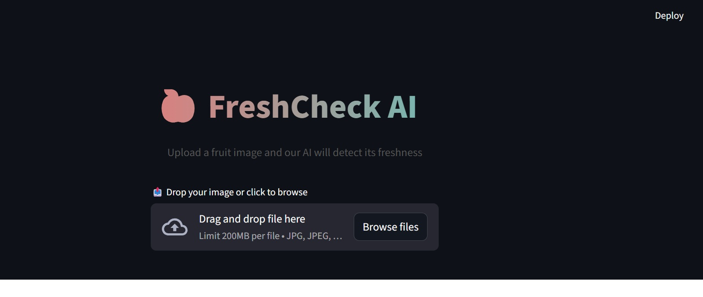
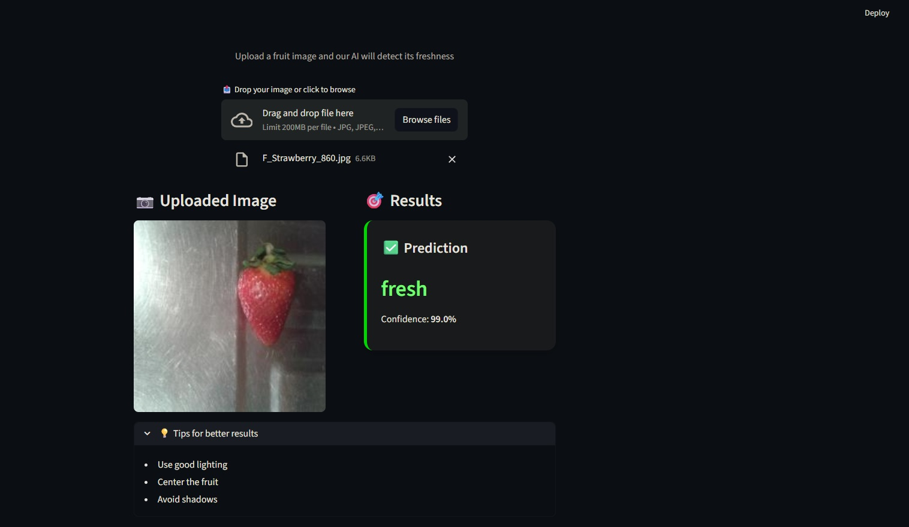
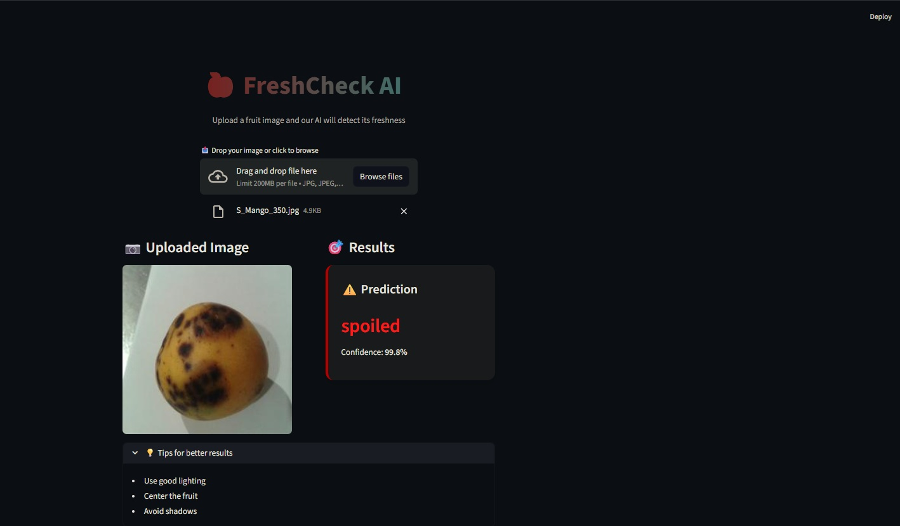

# 🥭 FreshCheck AI – Fresh vs Spoiled Fruit Classifier

FreshHarvest is a deep learning–based image classification project that predicts whether a fruit is **fresh** or **spoiled**.  
The model is trained using **transfer learning with ResNet-50** and deployed as an interactive **Streamlit web application**.

---

## 🚀 Features

- Binary classification: **Fresh vs Spoiled**
- Supports **8 different fruits**
- Uses **ResNet-50 (pretrained)** for strong visual feature extraction
- Lightweight fine-tuning (fast inference)
- Interactive **Streamlit UI**
- Ready-to-use trained model (no retraining required)

---

## 📸 Screenshots


### 🖥️ Application Home Screen


### ✅ Fresh vs Spoiled Result


---

## 📂 Project Structure

```text
streamlit_app/
│
├── artifacts/
│   ├── harvest_classifier_notebook.ipynb
│   └── harvest_classifier_resnet50.ipynb
│
├── models/
│   └── fruits_classifier_resnet50_tl.pth
│
├── app.py
├── app_v2.py        ← ✅ MAIN APPLICATION (use this)
├── model_definition.py
├── model_helper.py
├── requirements.txt
└── README.md
